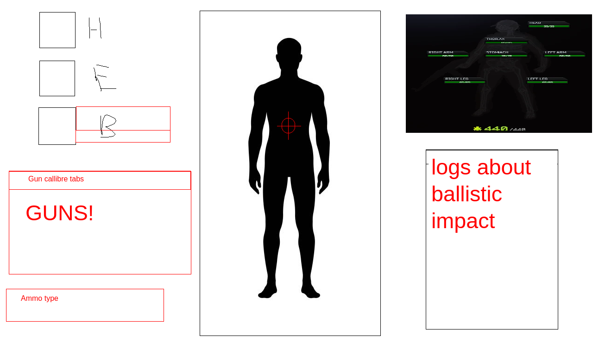

# TarkovBalisticSimulator
Project for "Javascript" course @ FMI
## The idea of the project is to create a simulation of the ballistics of "Escape from Tarkov".

Escape from Tarkov is a multiplayer tactical first-person shooter that strays from the "arcadey" type
of shooters and relies on a more realistic approach to the genre, where everything is taken into consideration:
the range of the engagement, the type of weapon system, the individual characteristics of the hundreds of different
ammo types, the type, and durability of the armor of the user as well as the amount of coverage it provides, and many,
many other factors.

Our goals are to create an accurate depiction of what the character model looks like (with the in-game hitboxes) 
and simulate the result of bullet and other different projectiles' impact on the character's body depending
on a variety of user-picked stats like the ones mentioned above - different bullet types, distance, weapon types,
the angle of impact, armor strength and durability, etc. Our ambitions are huge and we may expand way beyond what
is mentioned here, but this is a rough approximation of what is to be expected from our project.

## Sketch how the frontend will look
